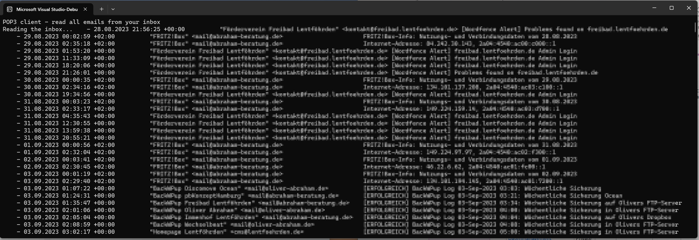

# Abraham.Mail

    


## OVERVIEW

Receive and send emails easily using the POP3, SMTP and IMAP protocols.
This nuget package contains 3 email clients to simplify the usage of the 
MailKit/Mimekit nuget packages.

Included are 4 simple demos that allow you to see:
- how to read your inbox
- how to send an email
- how to move an email between IMAP folders

For examples, please refer to the demo project on github.


## License

Licensed under Apache licence.
https://www.apache.org/licenses/LICENSE-2.0


## Compatibility

The nuget package was build with DotNET 6.


## INSTALLATION

Install the Nuget package "Abraham.Mail" into your application (from https://www.nuget.org).

Add the following code:
```C#
    var _client = new Abraham.Mail.Pop3Client()
				.UseHostname("ENTER YOUR POP3 SERVER NAME HERE")
				.UseSecurityProtocol(Security.Ssl)
				.UseAuthentication("ENTER YOUR USERNAME HERE", "ENTER YOUR PASSWORD HERE")
				.Open();

	Console.Write("Reading the inbox...");
	var emails = _client.GetAllMessages();
	emails.ForEach(x => Console.WriteLine($"    - {x}"));
```


That's it!

For more options, please refer to my Demo application in the github repository (see below).
The Demo and the nuget source code is well documented.


## HOW TO INSTALL A NUGET PACKAGE
This is very simple:
- Start Visual Studio (with NuGet installed) 
- Right-click on your project's References and choose "Manage NuGet Packages..."
- Choose Online category from the left
- Enter the name of the nuget package to the top right search and hit enter
- Choose your package from search results and hit install
- Done!


or from NuGet Command-Line:

    Install-Package Abraham.Mail


## ABOUT THE LIBRARY I AM USING

I am using the nuget package MailKit from Jeffrey stedfast.
This is an amazing piece of code!
You'll find the project website at http://www.mimekit.net
All thanks go to him.


## AUTHOR

Oliver Abraham, mail@oliver-abraham.de, https://www.oliver-abraham.de

Please feel free to comment and suggest improvements!


## SOURCE CODE

The source code is hosted at:

https://github.com/OliverAbraham/Abraham.Mail

The Nuget Package is hosted at: 

https://www.nuget.org/packages/Abraham.Mail


## SCREENSHOTS

POP3 client demo reading the inbox:



# MAKE A DONATION !
If you find this application useful, buy me a coffee!
I would appreciate a small donation on https://www.buymeacoffee.com/oliverabraham

<a href="https://www.buymeacoffee.com/app/oliverabraham" target="_blank"></a>
